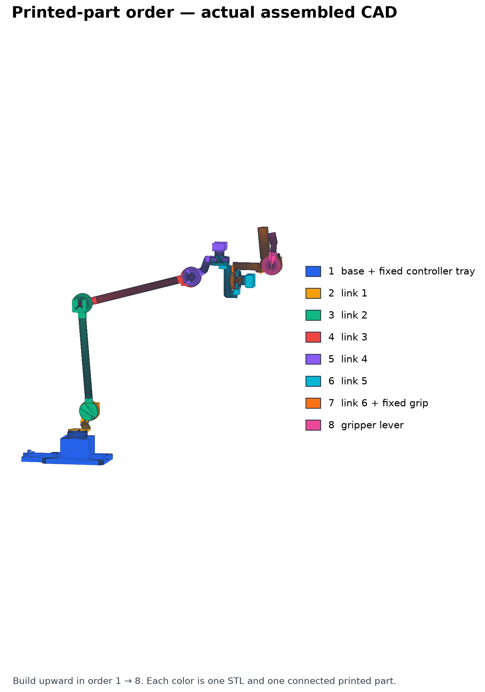
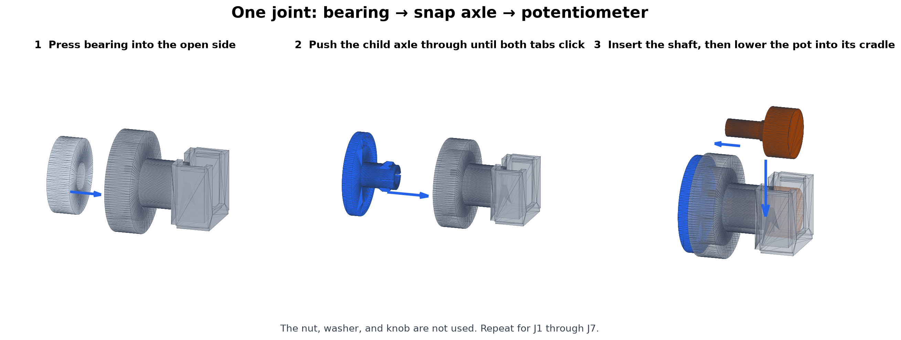
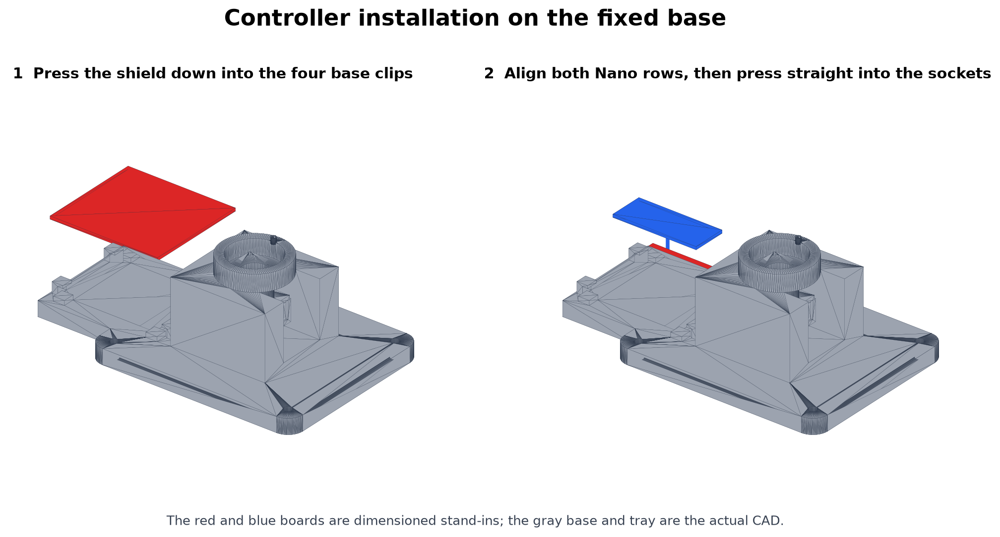
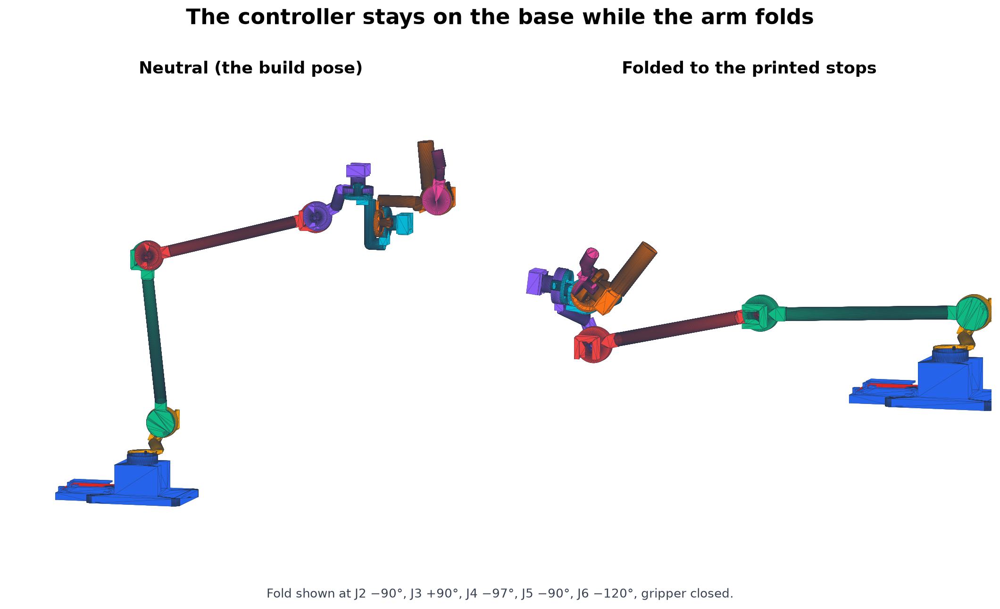
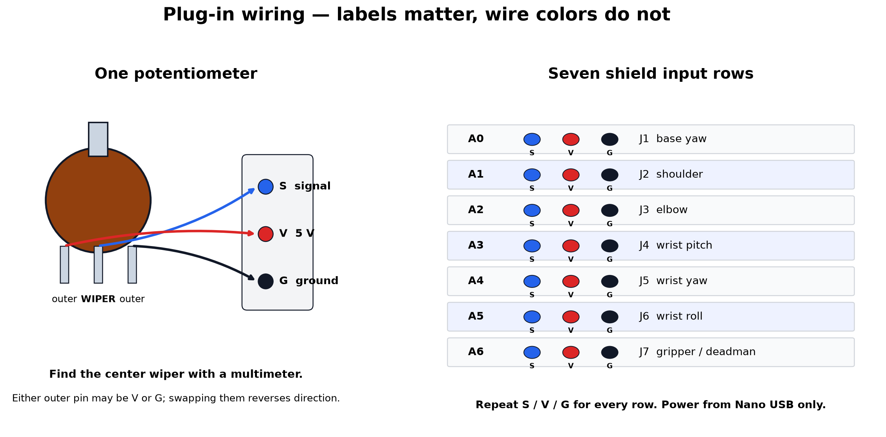

# Simple no-solder YAM leader

This branch builds a passive, seven-axis potentiometer controller for a YAM
robot. Each leader uses seven factory-wired B10K rotary potentiometers, seven
6000-2RS bearings, one Arduino Nano with soldered headers, one Nano I/O shield,
and eight printed PETG parts. The shopping list buys enough for **two leaders**.

This is a first-print prototype, not qualified hardware. Automated tests check
the nominal CAD, selected motion sweeps, and a documented cable-length model;
they do not prove printer fit, strength, cable clearance, or a collision-free
workspace. Print and pull-test the coupon before committing to the full arm.

## It is the YAM at 0.75 scale

The arm is a **uniformly scaled copy** of the follower, generated from
[`yam.urdf`](https://github.com/i2rt-robotics/i2rt/blob/main/i2rt/robot_models/arm/yam/v1/yam.urdf)
rather than drawn to fit a print bed. That matters because teleoperation here is
joint-space: each leader angle is sent straight to the matching follower joint.
Identical angles put your hand where the follower's gripper is *only* if every
segment carries the same scale factor. Scale the segments individually and the
angles stay legal while the correspondence you are steering by disappears.

| Segment | YAM | Leader at 0.75 |
| --- | ---: | ---: |
| Base to J1 | 68.0 mm | 51.0 mm |
| J1 to J2 (shoulder offset) | 60.2 mm | 45.1 mm |
| J2 to J3 (upper arm) | 272.8 mm | 204.6 mm |
| J3 to J4 (forearm) | 261.5 mm | 196.1 mm |
| J4 to J5 | 90.9 mm | 68.2 mm |
| J5 to J6 | 53.9 mm | 40.4 mm |

The follower's lateral shoulder and elbow offsets are reproduced too, so the
forearm folds past the upper arm the way the real arm's does. Built, the leader
reaches about 347 mm forward and stands about 359 mm tall.

**0.75 is a hardware floor, not a preference.** GELLO scales a UR5 by 0.2–0.3,
but its joint is a 24 mm servo and the UR5's wrist offsets are 95 and 82 mm.
YAM's J5-to-J6 offset is only 53.9 mm, and a joint here is a 26 mm bearing plus
a 17 mm potentiometer body whose shaft and cradle need 35 mm behind the
bearing. At 0.75 those joints are 40 mm apart and the wrist only packs at all
because J5's sensor faces away from the wrist and link 5 reaches J6's bearing
from behind. Going meaningfully smaller needs different joint hardware — a
smaller bearing with a 9 mm pot, or the AS5600 encoders the parent repo uses.

Only two of the leader's own dimensions are not scaled, and neither is a mapped
joint: the gripper lever pivots 72 mm out from the wrist roll axis rather than
the follower's 62 mm, because J6's potentiometer occupies the first 35 mm of
that direction; and the base plate, pedestal, and controller tray are sized for
the parts they hold.

`simple_cad/build_simple_leader.py` derives the whole chain from `LEADER_SCALE`
and the URDF rows above it, and `test_leader_is_a_uniformly_scaled_yam` fails if
any segment drifts off that single factor.

## Buy this for two complete leaders

This is the shopping list. Put the stated total quantity in the cart; the
quantities are for **both leaders together**, not per leader. Prices and links
were checked on **September 3, 2026**.

| Buy this item | Cart quantity | Select exactly this option |
| --- | ---: | --- |
| [TZT WH148 factory-wired potentiometer](https://www.alibaba.com/product-detail/TZT-WH148-Potentiometer-B10K-B100K-Speed_1600768301952.html) | **14** | `B10K`, linear taper, 15 mm shaft, XH2.54 three-pin lead |
| [6000-2RS bearing](https://www.alibaba.com/product-detail/10x26x8-mm-ABEC-7-6000-2rs_1600053563089.html) | **20** | `10×26×8 mm`, sealed `6000-2RS`; fourteen are used and six are spares |
| [TZT ATmega328P/CH340 Nano V3.0](https://www.alibaba.com/product-detail/TZT-Type-C-USB-Nano-3_1600566932166.html) | **2** | `328P-Welded-TYPE-C USB`; both long header rows must already be soldered |
| [TZT Nano I/O sensor shield](https://www.alibaba.com/product-detail/TZT-NANO-V3-0-Adapter-Prototype_1601021706384.html) | **2** | Fully assembled red 58×54 mm board with two Nano socket rows and S/V/G headers |
| [30 cm male-to-female Dupont ribbon, 40 wires](https://www.alibaba.com/product-detail/30cm-40pin-M-to-F-Color_1601699032813.html) | **3 ribbons** | `30cm`, `M to F`, `40P` |

**Buy three jumper ribbons.** A `40P` ribbon is forty separate one-conductor
jumper wires joined side by side; it is not forty three-wire cables. This arm is
a full-size scaled YAM, so its cable runs are much longer than a compact leader's:
with the controller fixed at the base and the CAD's 200 mm pot-lead assumption,
one arm uses fifteen three-wire extension segments, or **45 individual jumper
wires**. Two arms use 90; three ribbons provide 120. Some channels use four
30 cm segments chained end to end. The pot listing does not state the pigtail
length, and three ribbons cover it even if the delivered leads are as short as
100 mm, so the BOM no longer depends on that unstated specification.

An earlier cart, with **two** ribbons rather than three, showed a **$17.94 item
subtotal**, **−$0.60 item discount**, **$26.16 shipping**, and **−$11.16
shipping discount**, or **$32.34 before tax and import charges**. The third
ribbon adds one more ribbon's price to that, and shipping discounts change with
cart contents, so re-read the total at checkout rather than trusting the figure
above. Applying the current
[8.625% San Francisco sales-tax rate](https://www.cdtfa.ca.gov/taxes-and-fees/rates.aspx)
to the old subtotal gave **$35.13**; the third ribbon leaves the order still well
under $50, but Alibaba only shows the exact import charge at checkout, so use
the final charged total as the deciding number.

Also have one **1 kg spool of PETG**, **two USB-C data cables**, and either eight
#8 (about 4 mm) wood screws or two table clamps. Keep small reusable cable ties
or electrical tape for strain relief. The CAD's total solid volume is about
327 cm³ per leader — the scaled arm is larger than the compact prototype it
replaced — so a 1 kg spool still covers both leaders plus the coupon and
supports at the infill below.

## Print

Download this branch as a [ZIP](https://github.com/npow/open-source-leader-arm/archive/refs/heads/yam-encoder-leader.zip)
and use only `yam/simple_cad/generated/stl`. Do not use `cad_files/stl`; those
are parts for the upstream SO-ARM design.



First print one [`joint_fit_test.stl`](simple_cad/generated/stl/joint_fit_test.stl).
It is a disposable coupon for checking the bearing pocket, snap axle, split
shaft socket, and pot cradle. Seat a bearing, snap the two coupon pieces
together, install a pot, and pull firmly on the joint. Both snap shoulders must
remain behind the bearing's inner race and the printed wall must not crack.

One leader uses one copy of each file below; **print two copies of every file
for two leaders**:

1. [`simple_base.stl`](simple_cad/generated/stl/simple_base.stl), including the fixed controller tray
2. [`simple_link_1.stl`](simple_cad/generated/stl/simple_link_1.stl)
3. [`simple_link_2.stl`](simple_cad/generated/stl/simple_link_2.stl)
4. [`simple_link_3.stl`](simple_cad/generated/stl/simple_link_3.stl)
5. [`simple_link_4.stl`](simple_cad/generated/stl/simple_link_4.stl)
6. [`simple_link_5.stl`](simple_cad/generated/stl/simple_link_5.stl)
7. [`simple_link_6.stl`](simple_cad/generated/stl/simple_link_6.stl), including the fixed gripper jaw
8. [`simple_gripper_lever.stl`](simple_cad/generated/stl/simple_gripper_lever.stl)

Use PETG, 0.20 mm layers, five walls, six top/bottom layers, and 25% gyroid.
Keep each STL's exported orientation and enable organic/tree supports from the
build plate where needed. Use about 0.20 mm elephant-foot compensation if your
slicer supports it. If the coupon fit is wrong, tune the clearances described
in [`simple_cad/README.md`](simple_cad/README.md) and regenerate it; **do not
scale the STL** — the arm's proportions are what make it steer like the
follower — and do not drill out a load-bearing axle.

**Check your bed first.** The upper arm and forearm are the long parts:

| Part | Footprint as exported |
| --- | --- |
| `simple_link_2` (upper arm) | 35 × 232 mm |
| `simple_link_3` (forearm) | 218 × 79 mm |
| `simple_base` | 149 × 90 mm |

Everything else is under 110 mm. A 250 mm bed takes every part square on. A
220 mm bed takes the two long links only rotated onto the diagonal; a 180 mm
bed cannot print them at all.

Editable STEP files are in `simple_cad/generated/step`.

## Assemble one leader

Repeat this section for the second leader.

### 1. Join the eight printed parts



1. Press one 6000-2RS bearing fully into the open round socket on the base and
   on links 1 through 6. Push only on the bearing's **outer metal race**, not
   its seal or inner race.
2. Push link 1's axle straight through the base bearing until both printed
   shoulders click behind the inner race.
3. Continue in order: base → link 1 → link 2 → link 3 → link 4 → link 5 →
   link 6 → gripper lever.
4. Check that every joint turns freely and that gently pulling the child away
   from its bearing does not release the snap shoulders.

The bearing and printed flange carry the joint load. The potentiometer only
measures the angle; it is not the axle. No screws or glue belong in a joint.

### 2. Center and install the seven pots

The printed stops are no longer symmetric: each one is the follower's own
travel for that joint, seen from the leader's build pose. Centre the pot on the
middle of the *printed* travel, which is what the instructions below do, and the
host configuration handles the rest.

Do one joint at a time:

1. Put the printed joint at the middle of its travel — swing it gently to each
   stop and stop halfway between. Leave the gripper fully open for its zero
   position.
2. Temporarily connect the loose pot to the electronics as described below and
   rotate its shaft gently until the raw reading is about `512`.
3. **Unplug USB.** Push the shaft straight into the split socket, then lower the
   round pot body and threaded bushing into the U-shaped cradle.
4. Do not install the pot's metal nut, washer, or knob.
5. Reconnect USB and move only that joint slowly to both printed stops. Its raw
   reading should stay roughly between `20` and `1000`, and the pot body must
   not twist in its cradle.

### 3. Install the Nano shield and Nano



1. Rotate the red 58×54 mm Nano I/O shield so the Nano's USB connector will
   face outward, away from the J1 pedestal, then press the shield flat into the
   four clips on the base.
2. Match the labels on the Nano to the labels beside the shield sockets—for
   example, `VIN` to `VIN` and `GND` to `GND`. USB-connector direction alone is
   not a reliable guide.
3. Verify that every pin is over a socket, with no one-pin or one-row offset,
   then press both long header rows down evenly. A shifted or reversed Nano can
   destroy it when powered.

### 4. Secure the base

Clamp the base to the table or use its four mounting holes and four #8 (about
4 mm) wood screws. Secure it before moving the arm through its range.



Before routing wires permanently, move slowly into the pictured fold, which puts
five joints on their printed stops at once: J2 −90°, J3 +90°, J4 −97°, J5 −90°,
J6 −120°, and the gripper closed. The CAD collision test checks this fold at
five J1 yaw positions. Stop rather than force
the arm if a real printed part, board, or cable catches.

**One combination is out of bounds.** With the shoulder pitched forward past
J2 +20°, keep the elbow above J3 −60° or the wrist comes down onto the base
plate. A printed stop can only limit one joint at a time, so this pair is an
operating limit rather than a hardware one — the follower reaches its own mount
in the same corner of its workspace. Every other shoulder/elbow combination in
the CAD grid is clear.

The snap axles are serviceable but not intended for repeated disassembly. To
remove one, first remove the pot, squeeze both axle shoulders inward through
the cradle opening, support the bearing, and pull the child straight out.

## Wire one leader

Connect the seven pot wipers to the shield in this order:



| Shield | Joint |
| ---: | --- |
| A0 | J1 base yaw |
| A1 | J2 shoulder |
| A2 | J3 elbow |
| A3 | J4 wrist pitch |
| A4 | J5 wrist yaw |
| A5 | J6 wrist roll |
| A6 | Gripper/deadman |

### Check every three-wire connector before power

Marketplace wire colors and pin order are not trustworthy. With the pot
unpowered and disconnected, use a multimeter to identify its pins: resistance
between the two outer terminals stays near 10 kΩ, while resistance from the
center wiper to either outer terminal changes as the shaft turns. Connect:

- wiper → `S` (signal)
- either outer terminal → `V` (5 V)
- the other outer terminal → `G` (ground)

Swapping the two outer wires only reverses direction; putting 5 V or ground on
the wiper is incorrect. Confirm that the XH-style pot plug or individual male
jumper pins make firm contact before relying on them. The female ends of the
male-to-female jumpers fit the shield's male S/V/G headers. Never force a
housing that does not mate.

Power the Nano and seven low-current pots from USB only. Do not connect the
shield barrel jack or an external servo supply.

### How many jumper wires are used?

The pot seller does **not** specify the factory lead length. The CAD uses a
200 mm assumption, so measure the actual leads when they arrive.

- At 200 mm, J1 reaches directly; J2 uses one 30 cm three-wire segment; J3 and
  J4 use two; J5 and J6 use three; J7 uses four chained end to end.
- That consumes 45 individual jumper wires per leader and 90 for two leaders.
  Peel the ribbon into groups of three and join male to female where a second,
  third, or fourth segment is required.
- Three 40-wire ribbons provide 120 wires, leaving 30 spare under that
  assumption. They still cover the arm if the delivered pigtails turn out to be
  as short as 100 mm, so this does not hinge on the unstated lead length.

Leave a loose loop at every moving joint. A taut wire acts like a spring and
can distort the reading. Put male-to-female junctions on straight link sections,
not inside a bending loop, and secure each junction so normal motion cannot pull
it apart.

<details>
<summary>CAD cable-length calculation</summary>

| Channel | Centerline route | Moving joints crossed | Total lead needed | 30 cm jumper segments at 200 mm |
| --- | ---: | ---: | ---: | ---: |
| J1 | 61 mm | 0 | 96 mm | 0 |
| J2 | 143 mm | 1 | 234 mm | 1 |
| J3 | 334 mm | 2 | 507 mm | 2 |
| J4 | 512 mm | 3 | 765 mm | 2 |
| J5 | 608 mm | 4 | 919 mm | 3 |
| J6 | 655 mm | 5 | 1014 mm | 3 |
| J7 | 707 mm | 6 | 1114 mm | 4 |

The centerline route follows each intervening joint rather than cutting
straight through space. The total then adds 25% routing allowance, a 35 mm
service loop for every moving joint crossed, and 20 mm for connectors and
strain relief.

</details>

## Flash and test the controller

Open and upload
[`firmware/yam_encoder_leader/yam_encoder_leader.ino`](../firmware/yam_encoder_leader/yam_encoder_leader.ino)
in Arduino IDE:

1. Select **Arduino Nano**, the correct serial port, and **ATmega328P**. If the
   clone will not upload, try **ATmega328P (Old Bootloader)**.
2. Keep the gripper fully released while plugging in USB or resetting. The
   firmware averages that position as the deadman-off baseline.
3. Open Serial Monitor at 115200 baud. It should emit `YAMP1` frames at 100 Hz,
   and every raw channel should remain within `[4, 1019]`.
4. Move one joint at a time, confirm the expected channel changes smoothly,
   then pull lightly on its cable and recheck it.

The firmware averages four ADC reads per reported sample. A reading at an ADC
endpoint disables the deadman, but this is only a limited wiring check: an open
analog input can float to an apparently valid value. Squeezing the gripper by
about 25 counts sets the protocol's deadman bit. In the supplied hardware host
configuration, releasing it holds the follower at its current measured pose;
the simulation configuration ignores it by default. This is not a redundant
or safety-rated emergency stop.

## Run the follower software

Use the matching `yam-encoder-leader` branch of
[`npow/gello_software`](https://github.com/npow/gello_software/tree/yam-encoder-leader).
Edit the Nano port in `configs/yam_encoder_sim.yaml`, put the six arm joints in
the printed neutral pose with the gripper open, and test one leader in
simulation first:

```bash
python experiments/launch_yaml.py \
  --left-config-path configs/yam_encoder_sim.yaml
```

The configuration maps each pot's centred reading to the middle of that YAM
joint's own travel. Because the leader is a scaled copy, the mapping is now one
degree of leader for one degree of follower on every axis — no per-joint gain.
Three joints do need a **`joint_signs` entry of −1**: J1, J5, and J7 have their
potentiometers mounted facing the other way, which is what buys the pedestal and
the wrist their clearance. If any other joint moves backward, fix it in
`joint_signs` too; do not swap wires while powered. Use
`configs/yam_encoder_hw.yaml` only after directions, limits, disconnect
behavior, rate limits, and the gripper deadman all work in simulation.

### What the leader cannot reach

The printed stop for each joint is that follower joint's own limit, with two
exceptions worth knowing before you plan a task:

| Joint | Follower travel | Leader travel | Given up |
| --- | --- | --- | --- |
| J1 base yaw | −150° to +180° | ±140° | 40° one way, 10° the other |
| J3 elbow | 0° to 180° | 16° to 180° | 16° at the folded end |

J1 asks for 330°, which is more than one 300°-travel potentiometer can measure,
so its stops are set symmetrically inside what the pot can read. J3 stops short
because at the last 16° of its fold the printed forearm reaches the upper arm —
fatter beams than the real arm's. Every other axis reaches its follower limit
exactly.

The command above launches one leader. For two, copy the config for the right
side, give it the second Nano's distinct serial port and the right follower's
distinct robot/CAN endpoint, then add `--right-config-path` to the command.
Never configure both sides to use the same serial or CAN device.

## Known prototype limitations

- Print and pull-test the coupon. FDM fit and snap strength vary by printer,
  PETG, cooling, and layer adhesion; this design has no certified load rating.
- Every joint reaches its complete printed-stop range with the whole distal
  chain attached, and the fixed controller clears the checked wrist-corner and
  folded-stop poses. The shoulder/elbow pair is swept as a grid, which is where
  the J2 +20° / J3 −60° operating limit above comes from. Those samples still do
  not prove that every arbitrary multi-joint combination is free of
  self-collision; move slowly and never force a fold.
- The arm is a faithfully scaled YAM, which means it inherits the follower's own
  folded self-collisions rather than being a stubbier shape that avoids them. A
  URDF joint limit is not a promise of a collision-free workspace, on either
  arm.
- Collision tests include a conservative 78×74×22 mm envelope for the shield,
  Nano, headers, and plugs. The exact marketplace parts and flexible wire paths
  still require physical inspection.
- WH148 carbon potentiometers are inexpensive wear parts, not precision
  encoders. Verify linearity, backlash, electrical travel, and connector grip.
- This is prototype hand-input equipment, not a payload support or a
  safety-rated control device.

CAD source, regeneration instructions, and geometry tests are in
[`simple_cad`](simple_cad/README.md).
